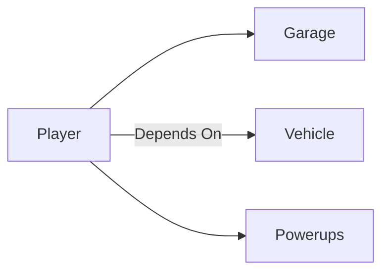
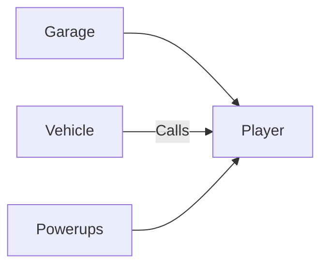

[vertical slice architecture]: https://www.milanjovanovic.tech/blog/vertical-slice-architecture

[single responsibility principle]: https://www.digitalocean.com/community/conceptual-articles/s-o-l-i-d-the-first-five-principles-of-object-oriented-design#single-responsibility-principle

[@aarthificial]: https://github.com/aarthificial

[inversion of control]: https://stackoverflow.com/a/3140

[`Area3D`]: https://docs.godotengine.org/en/stable/classes/class_area3d.html

# Players and Dependencies

What's in a player? It's a simple question: the person playing the game except what are the technical requirements? Perhaps just a mere controller for a rigid body except what about the state associated with the player? What about the player's dependencies since it certainly isn't just a mere controller isn't it? How does it communicate with these dependencies and to dependents? These are guiding questions, sure, but it is a start in order to break down this large technical feature down to more manageable details.

## Vertical Slices

It sounds daunting that the player alone not being a mere character controller encompasses a wide range of functionality thus manages a wide scope of features, but fortunately it doesn't have to directly manage all of those by itself. A technique more easily afforded to us by the [vertical slice architecture] is delegation to subsystems, and in turn, follows the [single responsibility principle] which enhances long term maintainability.

This delegation of otherwise responsibilities that are not actually the job of the player code to subsystems that actually take care of the dirty work reduces the overall surface area one would think in — a bit like subdividing a large tasks into microtasks. Our player subsystem then can be defined as the sum between the subsystems that it is dependent on and the processed player inputs.

While we're getting nearly there it isn't quite enough as this still is quite daunting and expansive. What if we flipped the problem on its head, what if instead the player subsystem calling other subsystems we instead inverse the relation where instead these subsystems instead calls player related code. This is something that's known as [inversion of control] — "don't call us, we'll call you".

## Dependency Inversion

Now we're getting somewhere. Let's start with what should be in theory the simplest of these subsystems, power-ups, and give you an idea of where this should go.

You'd of course need a way to collect power-ups which is where Godot's [`Area3D`] node comes into play. This node can detect whenever any other node intersects within the space that it encompasses and trigger any behaviors accordingly where in our case we'd want it to trigger an event/signal for giving the player a power-up and to animate the change in state.

## Packing Up
