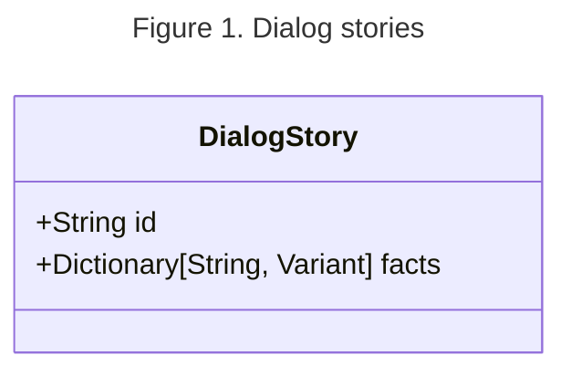
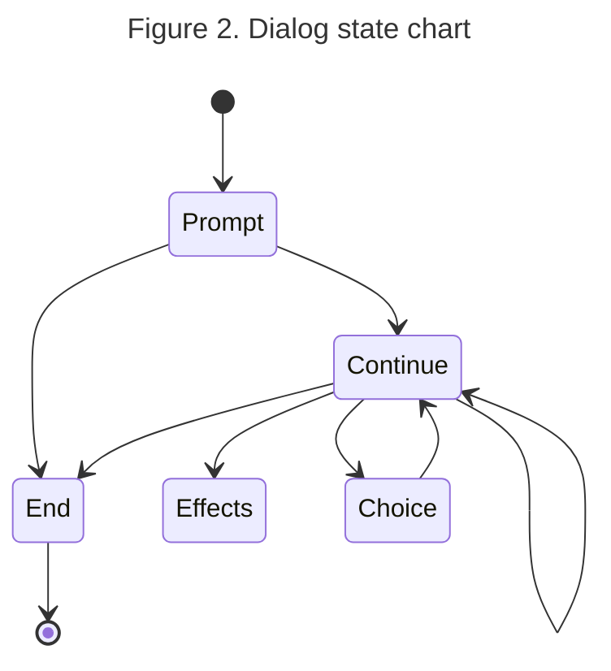

[Dialogic]: https://github.com/dialogic-godot/dialogic
[Dialogue Manager]: https://dialogue.nathanhoad.net
[Orchestrator]: https://docs.cratercrash.space/orchestrator/getting-started/introduction/introduction-to-orchestrator/
[Dynamic Conversations]: https://youtu.be/1LlF5p5Od6A
[@aarthificial]: https://www.youtube.com/@aarthificial
[facade pattern]: https://refactoring.guru/design-patterns/facade

# (Another) Contextual Dialog Implementation

  <i>As if we didn't have enough of these already</i>

The dialog system itself is delegated to a third party library called [Dialogue Manager] although there are some bits that it's flexibility doesn't quite provide. How one would handle dialog context and responding to dialog contents.

[@aarthificial]'s video titled [Dynamic Conversations] has the answer that I would be looking for and had been cited within one of the group's documents, in particular the idea that the context is stored as a separate data structure independent of the game. This has the benefit where in-game dialog is not as tightly coupled to the game state, instead querying the dialog context through some form of proxy (or in other words, an implementation of the [facade pattern]).

Here the data structure that represents this proxy are internally called stories which contain a collection of facts which themselves describe data that the dialog depends on. The dialog spoken by the characters will depend on the values of the facts within the stories provided to the dialog. This would entirely be moot however if the dialog can't be rendered in game.

To get the dialog rendered in the first place there exists the method `.get_next_dialogue_line` which returns an empty dictionary when the dialog has been finished but that by itself wouldn't be enough. This necessitates more to the subsystem that roughly follows this statechart.

The `Continue` node should be self-explanatory enough though `Effects` may bring up some questions. This are effects that are ran in response to [tags](https://github.com/nathanhoad/godot_dialogue_manager/blob/main/docs/Basic_Dialogue.md#tags) defined within the dialog itself, and is intended to be a more declarative alternative to mutations by shifting responsibility to the dialog caller.

This should in theory be what's needed to implement the dialog system. This post will be updated with additional information as the subsystem is being designed.
